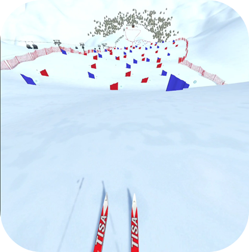
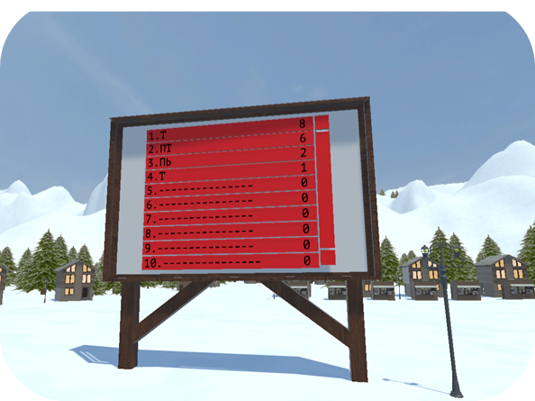
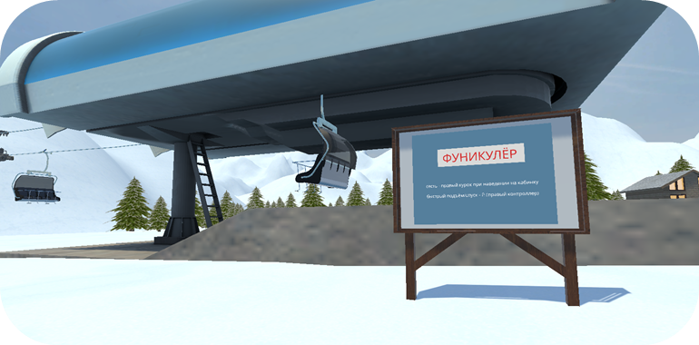
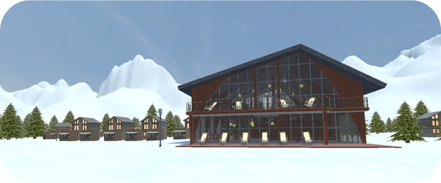
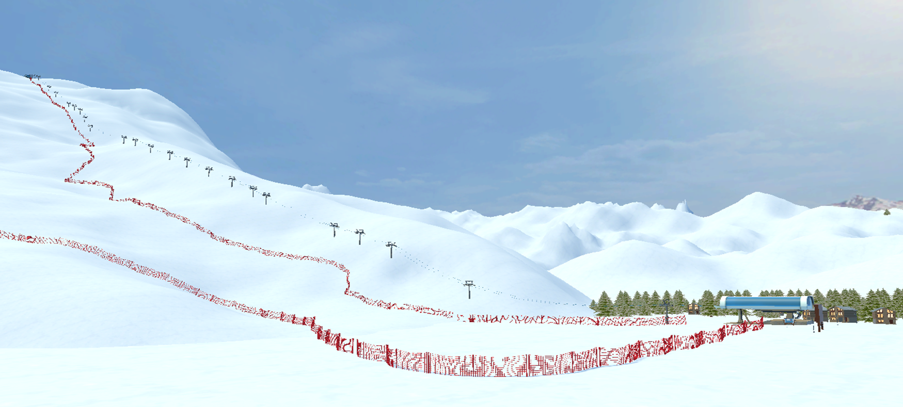

# «Вираж VR»

VR-симулятор горнолыжного курорта

## О проекте

Виртуальный горнолыжный курорт с динамичным спуском и атмосферной зоной отдыха. Игроки, не выходя из дома, могут получить уникальный опыт катания на лыжах, посоревноваться за звание лучшего спортсмена и прогуляться по уютной детализированной локации.

## Моя роль

- Реализация VR-взаимодействий (захват, перемещение, использование объектов)

- Настройка VR-окружения и работа с Terrain

- Реализация логики движения фуникулера и возможности перемещения на нем для игрока
 
- Разработка систем ввода имени, сохранения результатов в файл и отображения таблицы рекордов

- Реализация механики интерактивного спуска на лыжах (физическое взаимодействие с трассой, система управления движением с использованием контроллеров и данных акселерометра)

- Интеграция UI (инструкции, интерфейс)

- Тестирование и доработка

## Технологии

Unity

C#

Steam VR

Visual Studio

UI System

## Видео игрового процесса

[Ссылка на видео](https://drive.google.com/file/d/1KflfiPjS61lGUdMxazamP6Exv-d-eIlF/view?usp=sharing)

## Билд

[Скачать последнюю версию](https://github.com/darsidaff/Turn-VR/releases/tag/V1)

## Скриншоты

 
 

